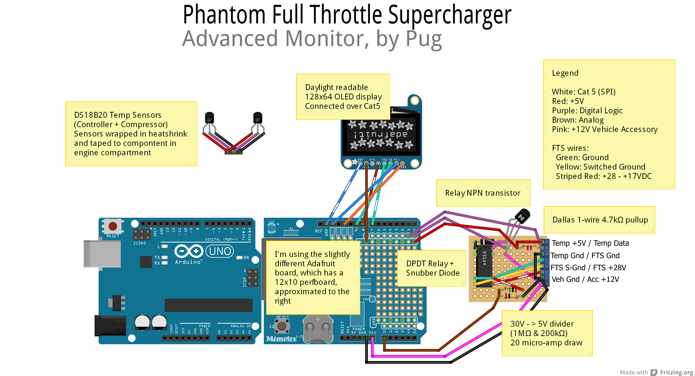

Phantom Full Throttle Supercharger - Advanced Display
=====================================================

Datalogging, and more visualizations of the electric-powered full-throttle supercharger from [Phantom Superchargers](http://www.phantomsuperchargers.com/)

Bill of Materials
------------------------
* Arduino Uno [@Adafruit](http://www.adafruit.com/products/50)
* Adafruit Datalogging Shield [@Adafruit](http://www.adafruit.com/products/1141)
* Radioshack mini DPDT relay [@RadioShack](http://www.radioshack.com/product/index.jsp?productId=2062483)
* Monochrome 0.96" 128x64 OLED graphic display [@Adafruit](http://www.adafruit.com/product/326)
* 1x PN2222 NPN Transistor [@Adafruit](http://www.adafruit.com/products/756)
* 1 1N4001 diode [@Adafruit](http://www.adafruit.com/products/755)
* 2x DS 18B20 Digital Temperature sensors [@Adafruit](http://www.adafruit.com/products/374)
* 1x 1 M Ohm resistor
* 1x 200 k Ohm resistor
* 3x 1k ohm resistors
* 1x 440 ohm resistor
* 1x SD card for logging
* Wire, various colors
* Perfboard / Protoboard
* 3/4 inch and 1/8 inch heatshrink, for temperature probes
* High-temperature tape (For temperature probes)


Circuit Design
------------------------

Diagram exports and original files are in the [./design/]() folder. 

### Errata
There is also an [errata list](./design/Errata.md) of things not currently included in the diagrams.

Compiling
------------------------
Use the Arduino IDE; you must install the dependencies as libraries within dependencies/ . That includes installing u8glib, which must be downloaded and installed. See [./dependencies/README.md]()

To download the submodules:
```
 git submodule init
 git submodule update
```

See [./dependencies/README.md]() for instructions on loading them into the Arduino IDE; in particular the U8glib library needs special care.

Usage
------------------------
You must ensure the Real-time Clock is set before logging can function; load, compile, install and run the *ds1138* sketch example once to set the clock. Then you should re-compile and load the Monitor software immediately, as the ds1138 sketch will set the RTC clock to its' compile time each time it starts.


Next Steps
------------------------
After proving the circuit in real-world testing, the next revision is planned to be rendered to PCB form for added compactness. Given the lack of Fritzing-based fabrication facilities, rev 5 of the circuit design will be based on EagleCAD.
